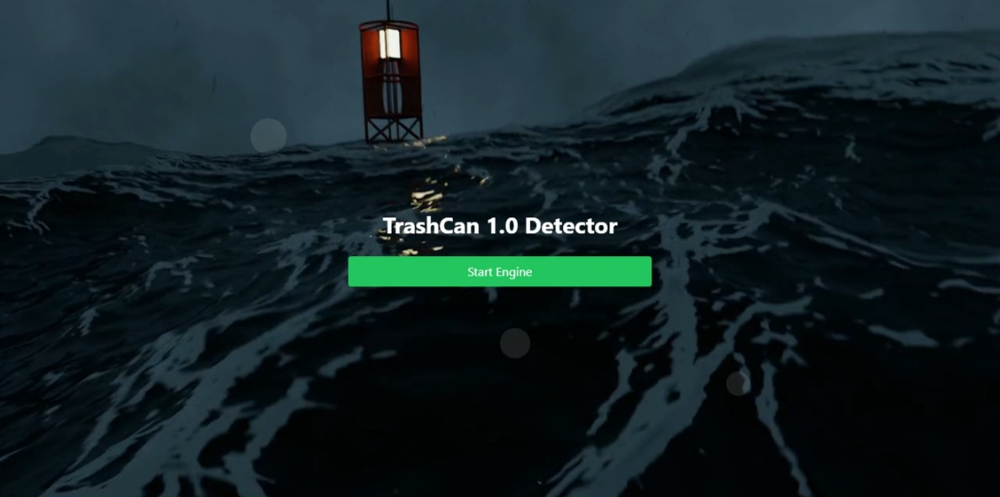

# 🌊 DeepSeaVision: AI-Powered Underwater Trash Detection 🤖


## 🎓 DEPI Digital Egypt Pioneers Initiative Scholarship Project

This project is proudly submitted as part of the graduation requirements for the AI and Data Science track, with a focus on the Microsoft Machine Learning Engineer job profile.

### 🚀 Project Overview

DeepSeaVision is a cutting-edge machine learning solution designed to identify and classify various types of trash in underwater environments. Our mission is to contribute to ocean cleanup efforts by providing a powerful tool that can accurately detect and categorize marine debris.

#### 🌟 Key Features

- 🔍 Real-time object detection of underwater trash
- 🏷️ Classification of debris into categories (e.g., plastic, metal, glass)
- 📷 Seamless integration with underwater camera systems
- 🖥️ User-friendly interface for easy deployment and use

### 📚 Table of Contents

- [Installation](#installation)
- [Usage](#usage)
- [Model Training](#model-training)
- [Testing](#testing)
- [Contributing](#contributing)
- [License](#license)
- [Acknowledgements](#acknowledgements)

### 💻 Installation

To set up DeepSeaVision on your local machine, follow these steps:

1. Clone the repository:
   ```
   git clone https://github.com/your-username/deepseavision.git
   cd deepseavision
   ```

2. Create a virtual environment and activate it:
   ```
   python -m venv venv
   source venv/bin/activate  # On Windows, use `venv\\Scripts\\activate`
   ```

3. Install the required dependencies:
   ```
   pip install -r requirements.txt
   ```

### 🔧 Usage

To use DeepSeaVision:

1. Ensure you have completed the installation steps.
2. Run the main application:
   ```
   python src/main.py
   ```
3. Follow the on-screen instructions to upload an image or start live detection.



### 🧠 Model Training

The model training process is documented in the Jupyter Notebook located at `notebooks/model_training.ipynb`. This notebook covers:

- 🔢 Data preprocessing
- 🏗️ Model architecture
- 🏋️‍♂️ Training process
- 📊 Evaluation metrics

To run the notebook:

1. Ensure you have Jupyter installed (`pip install jupyter` if not).
2. Navigate to the `notebooks` directory.
3. Run `jupyter notebook` and open `model_training.ipynb`.

### 🙏 Acknowledgements

- 🏆 DEPI Digital Egypt Pioneers Initiative for their support and guidance
- 🌍 [List any other organizations or individuals who contributed to the project]

### 👨‍💻 Meet the Team

- **Mohamed Ismail** - *Machine Learning Engineer* - [GitHub Profile](https://github.com/mohamed-ismail)
- **Kirollos Eisa** - *Machine Learning Engineer* - [GitHub Profile](https://github.com/kirollos-eisa)

---

For any questions or feedback, please contact Mohamed Ismail at [mohamed.ismail@example.com] or Kirollos Eisa at [kirollos.eisa@example.com].

[](https://your-project-website.com)