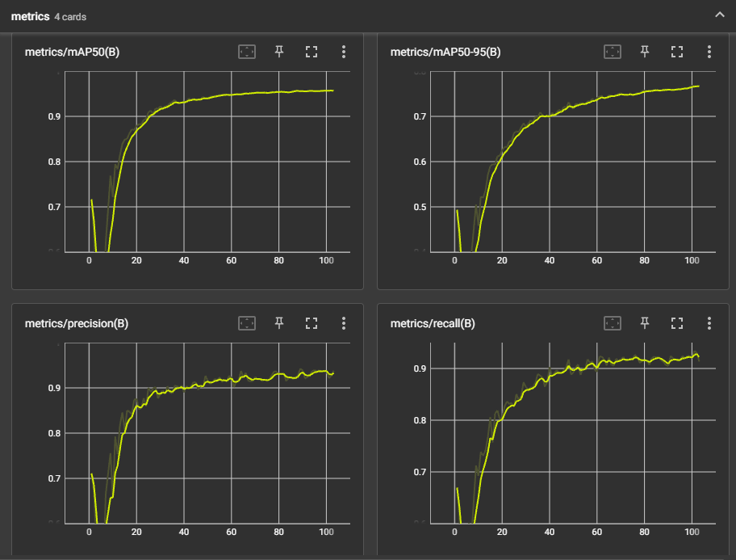
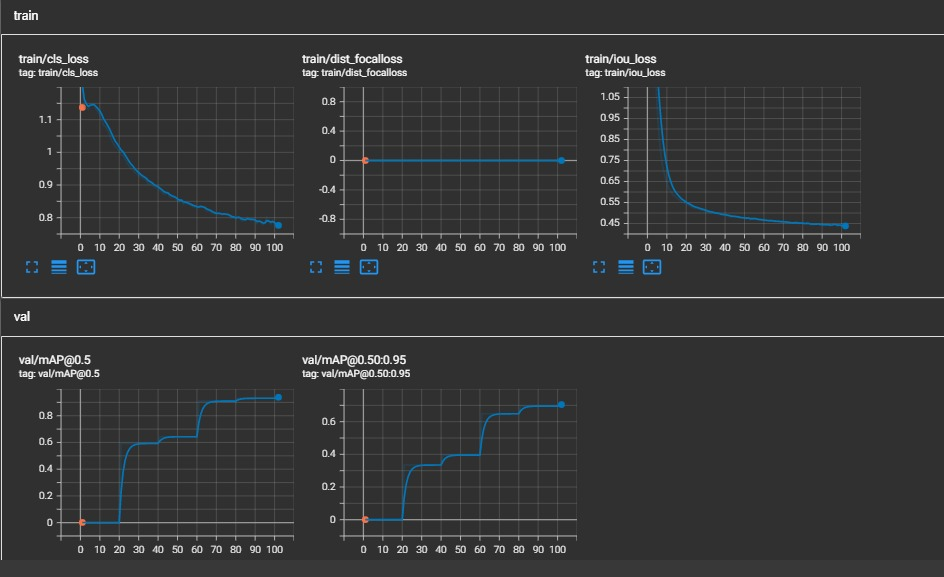
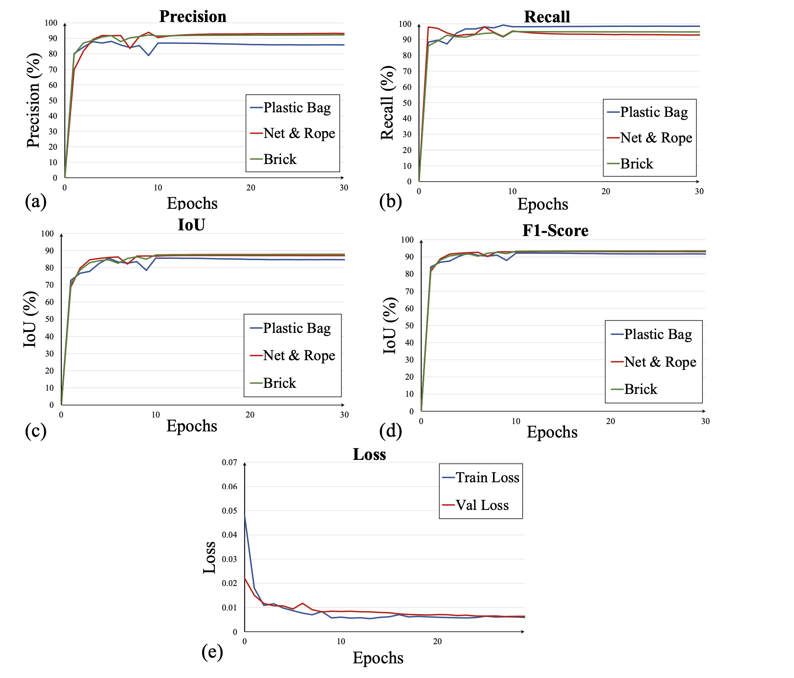

# Comparison of YOLOv8x and Fast R-CNN for TrashCan1.0 Object Detection

This README compares the performance of YOLOv8x and Fast R-CNN models on the TrashCan V1.0 dataset for object detection of waste items.

## YOLOv8x Results

### Video Demo

https://github.com/user-attachments/assets/20eaf90f-70fd-446c-8cad-35d9c5f6e19e

### Performance Metrics

YOLOv8x training and validation metrics:

Key observations:
- Training loss decreases steadily, with validation loss following a similar trend
- mAP metrics show consistent improvement over training epochs
- Final mAP@0.5 reaches approximately 0.87
- Final mAP@0.5:0.95 reaches approximately 0.68

Detailed metric plots:

Additional insights:
- Precision and recall both improve over time, with recall showing more volatility
- mAP50 and mAP50-95 exhibit smooth increasing curves
- Training converges around 80-100 epochs

## Fast R-CNN Results

Performance metrics for Fast R-CNN:

Key observations:
- Precision, recall, IoU, and F1-score are plotted for three classes: Plastic Bag, Net & Rope, and Brick
- All metrics show rapid initial improvement, followed by stabilization
- Final precision values range from ~88% to 95%
- Final recall values range from ~92% to 97%
- IoU and F1-scores closely follow precision and recall trends
- Training and validation loss both decrease steadily, with validation loss slightly higher

## Comparative Analysis

1. Detection Speed:
   - YOLOv8x is likely faster for real-time detection due to its single-stage architecture
   - Fast R-CNN may have longer inference times but potentially higher accuracy

2. Accuracy:
   - Both models achieve high precision and recall
   - YOLOv8x reaches mAP@0.5 of 0.87, indicating strong overall performance
   - Fast R-CNN shows class-specific metrics, with high precision and recall across classes

3. Training Efficiency:
   - YOLOv8x appears to require more epochs (80-100) to converge
   - Fast R-CNN shows rapid improvement in early epochs, stabilizing quickly

4. Class Performance:
   - Fast R-CNN provides class-specific metrics, showing slight variations between classes
   - YOLOv8x metrics are aggregated, making class-specific comparison difficult

5. Loss Curves:
   - Both models show expected decreasing loss trends
   - YOLOv8x exhibits smoother loss curves compared to Fast R-CNN

## Conclusion

Both YOLOv8x and Fast R-CNN demonstrate strong performance on the TrashCan1.0 dataset. YOLOv8x may be preferable for real-time applications, while Fast R-CNN provides more detailed class-specific metrics. The choice between the two depends on specific project requirements such as inference speed, granularity of metrics needed, and deployment constraints.

To make a final recommendation, consider running both models on a common test set and comparing inference times and accuracy metrics directly.
